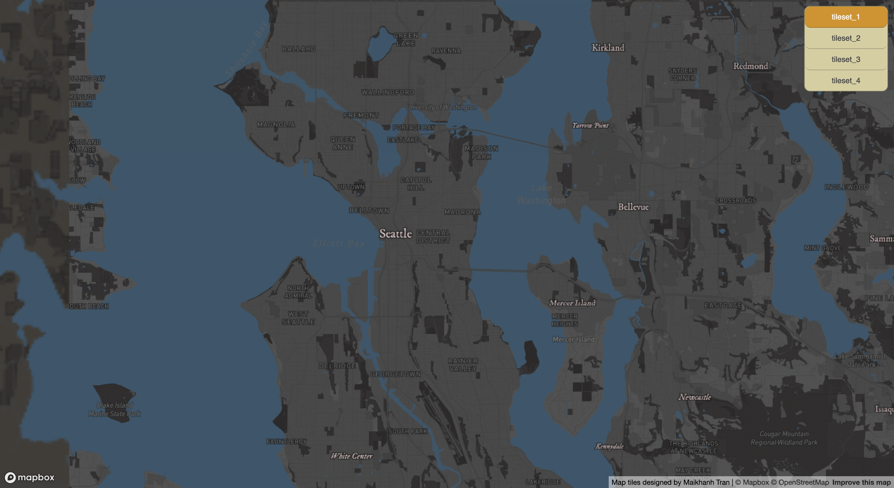
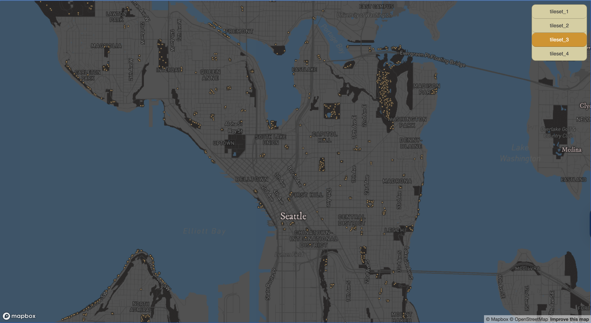
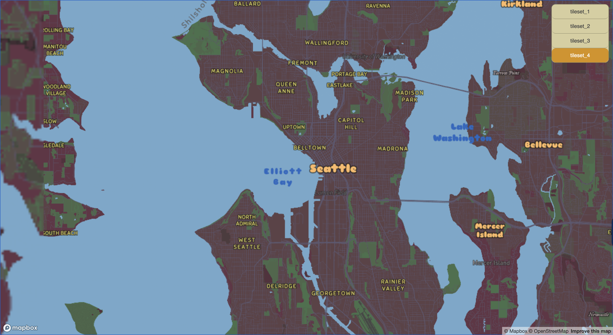

# Map-Designs-with-Tiles

## Project Introduction
This project applies raster map design and tile generation.
Focusing on map design, there are 4 map layer options to toggle through. The thematic map is based on the Seattle dataset of public park benches, following with a custome mapbox map based on winter sunsets, inspired from the perpective of sitting at a park bench viewing the sunset here in Seattle!

## Viewing Tile Map Sets
**Raster Tile Map Designs**  
https://Maikhanhvt.github.io/Map-Designs-with-Tiles/index.html
  
  
  
  

## Map Designs
- **tileset_1** – A basemap in dark theme.   
- **tileset_2** - Thematic layer of Seattle Park Benches (geospatial dataset), a focus on public space and its amenities.  
- **tileset_3** Combination of the basemap & data as a thematic map.  
- **tileset_4** - Winter Sunset Theme – A custom stylized map using warm tones inspired by sunset colors and spring.

## Data Sources
- https://data.seattle.gov/dataset/Park-Bench/ypn3-dhhi/about_data

## Examined Geographic Area
- Seattle, Washington

---

## Zoom Levels of Tile Set
**tileset_1**: 3-14
**tileset_2**: 1-14
**tileset_3**: 3-14
**tileset_4**: 1-14
Projection: ESPG: 3857

---

## Libraries & Resources Used
- Mapbox GL JS
- Mapbox Studio
- QGIS
- QMetaTiles (QGIS plugin)
- OpenStreetMap

## Credits & Acknowledgments  
- City of Seattle Open Data